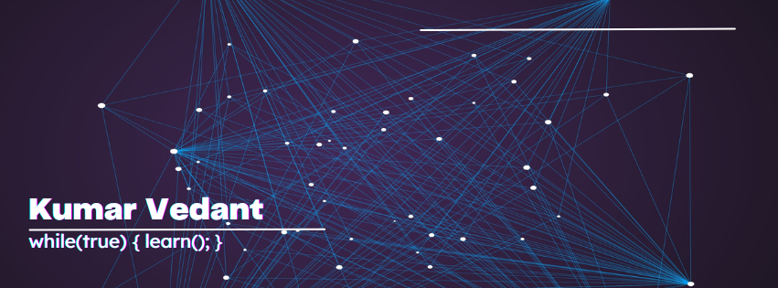

## 👋 I'm Vedant, engineer in training, developer by instinct.

🚀 Game plan: Write systems that run fast, agents that learn smart, and interfaces that just work.

💻 As a hands-on learner and builder, I’ve designed systems from the ground up - from building a custom version control tool in C++ to training Reinforcement Learning agents that play games directly from mobile input. I approach engineering challenges with a focus on fundamentals, performance, and maintainability.

### 🚀 Top Skills

